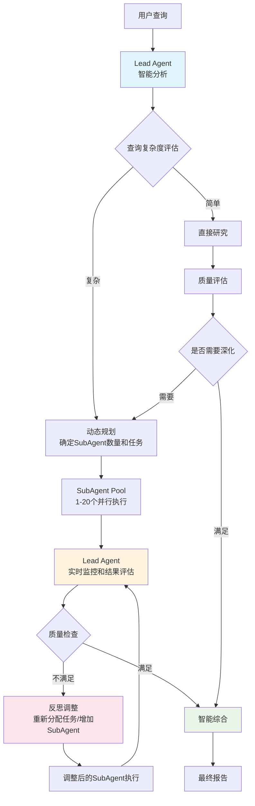

# Deep Research - 多智能体研究系统

[](https://www.python.org/downloads/)
[](LICENSE)
[](https://github.com/psf/black)

**基于 Claude 官方多智能体架构文档，通过 Claude Code 一天快速实现的智能研究系统，达到超越 deer-flow 的深度研究效果。**

## 🎯 项目特色

- **📚 官方架构参考**: 深度研读 [Anthropic 多智能体最佳实践](https://www.anthropic.com/engineering/multi-agent-research-system)
- **⚡ 快速实现**: 借助 Claude Code 一天完成核心功能开发
- **🧠 高度智能**: Lead Agent 拥有充分自主权，展现出色的适应性
- **🔄 双重架构**: 提供传统工作流和创新多智能体两种实现方式
- **📊 完整监控**: 集成 LangSmith 实现智能体行为全链路追踪

## 🏗️ 系统架构

### 核心设计理念
系统采用极简架构，仅包含两个核心智能体，但 **Lead Agent 具有完全自主的反思决策能力**：
- **Lead Agent**: 主导智能体，具有任务分析、动态规划、质量评估、自主调整的完整决策链
- **Research SubAgent**: 研究子智能体，执行 Lead Agent 动态分配的专项研究任务



## 🚀 快速开始

### 环境配置

1. **克隆项目**
   ```bash
   git clone <repository-url>
   cd deep_research
   ```

2. **安装依赖**
   ```bash
   pip install -r requirements.txt
   ```

3. **配置 API**
   ```bash
   cp .env.example .env
   # 编辑 .env 文件，添加你的 API Keys
   ANTHROPIC_API_KEY=your_key_here
   TAVILY_API_KEY=your_key_here  # 用于网络搜索
   ```

### 使用方式

## 🎯 推荐方式：多智能体架构

**最佳体验** - 展现了极高的智能水平和自主性：

```bash
# 交互式研究会话
python multi_reactagent.py -i

# 单次研究查询
python multi_reactagent.py "分析人工智能在医疗诊断中的最新发展"

# 保存研究报告
python multi_reactagent.py "比较中美欧三地的新能源政策" -o report.md
```

**特点**：
- ✨ **完全自主决策**: Lead Agent 自主确定 SubAgent 数量（1-20个）和具体任务分配
- 🔄 **反思调整能力**: 实时监控 SubAgent 输出，智能评估质量并动态调整研究计划
- ⚡ **动态并行优化**: 根据研究进展自适应调整并发策略和任务分解
- 🧠 **智能质量控制**: 持续评估研究深度，自主决定是否需要补充研究或重新规划

## 📋 对比方式：传统工作流

**传统实现** - 结构化步骤处理：

```bash
# 运行工作流版本（用于对比）
python workflow_agent.py
```

**特点**：
- 📝 预定义工作流步骤
- 🔄 状态持久化
- ⚙️ 检查点恢复
- 📊 结构化处理流程

## 💡 Python API 使用

### 多智能体方式（推荐）

```python
import asyncio
from src.react_agents.multi_agent_system import MultiAgentLeadResearcher

async def research_example():
    # 初始化智能研究系统
    researcher = MultiAgentLeadResearcher()
    
    # 执行研究
    result = await researcher.research("量子计算的商业化前景分析")
    
    if result["success"]:
        print(f"研究报告：\n{result['report']}")
        print(f"执行时间: {result['execution_time']:.2f} 秒")

# 运行示例
asyncio.run(research_example())
```

### 工作流方式（对比）

```python
import asyncio
from src.cli import ResearchCLI

async def workflow_example():
    # 初始化工作流系统
    cli = ResearchCLI()
    await cli.initialize()
    
    # 执行结构化研究
    report_id = await cli.run_research("区块链技术发展趋势", verbose=True)
    print(f"报告已保存，ID: {report_id}")

# 运行示例  
asyncio.run(workflow_example())
```

## 📊 两种方式对比

| 特性 | 多智能体架构 | 传统工作流 |
|------|-------------|-----------|
| **智能程度** | 🌟🌟🌟🌟🌟 极高自主性 | 🌟🌟🌟 结构化处理 |
| **适应性** | 🔄 实时策略调整 | ⚙️ 预定义流程 |
| **执行效率** | ⚡ 动态并行优化 | 📋 按步骤执行 |
| **结果质量** | 🎯 智能深度分析 | 📊 全面系统整理 |
| **适用场景** | 复杂研究、探索性分析 | 标准化研究、批量处理 |

## ⚙️ 配置选项

主要环境变量：

```env
# 模型配置
LEAD_AGENT_MODEL=claude-opus-4-1-20250805    # 主导智能体模型
SUBAGENT_MODEL=claude-sonnet-4-20250514      # 研究子智能体模型

# 执行参数
MAX_CONCURRENT_SUBAGENTS=5                      # 最大并发子智能体数量
MAX_ITERATIONS=5                                # 最大研究迭代次数

# API 配置
ANTHROPIC_API_KEY=your_anthropic_key            # Claude API
TAVILY_API_KEY=your_tavily_key                  # 网络搜索API
LANGSMITH_API_KEY=your_langsmith_key            # LangSmith 监控追踪

# 监控配置（可选）
LANGSMITH_TRACING=true                          # 启用 LangSmith 追踪
LANGCHAIN_TRACING_V2=true                      # 启用详细追踪  
LANGCHAIN_PROJECT=deep-research                 # 项目名称
```

## 🔧 开发与测试

```bash
# 运行测试
python -m pytest tests/

# 代码格式化
black src/ tests/

# 类型检查  
mypy src/
```

### 🔍 LangSmith 监控

系统集成了 **LangSmith** 用于智能体行为监控和性能分析：

- **实时追踪**: 监控每个智能体的决策过程和工具调用
- **性能分析**: 分析响应时间、Token 消耗和成功率
- **调试辅助**: 可视化智能体推理链和错误定位
- **质量评估**: 追踪研究质量和用户满意度指标

**启用监控**:
```bash
# 在 .env 文件中配置
LANGSMITH_API_KEY=your_key
LANGSMITH_TRACING=true

# 运行研究时会自动上报到 LangSmith Dashboard
python multi_reactagent.py "你的研究问题"
```

## 📈 性能特征

- **响应时间**: 30-120秒（复杂研究）
- **并发能力**: 1-20个子智能体
- **信息源**: 每次查询10-50+个来源
- **智能程度**: 展现接近人类专家水平的研究能力

## 🎉 实现亮点

1. **官方架构指导**: 基于 Anthropic 多智能体最佳实践文档
2. **极速开发**: Claude Code 辅助下一天完成核心功能
3. **架构精简**: 仅用两个智能体实现复杂研究能力
4. **反思决策**: Lead Agent 具备完整的监控-评估-调整决策循环
5. **自主规划**: 智能确定研究策略、SubAgent 数量和任务分配
6. **效果对标**: 达到 deer-flow 等先进系统的研究质量

## 🤝 贡献指南

欢迎贡献代码！请查看 [CONTRIBUTING.md](CONTRIBUTING.md) 了解详细信息。

## 📝 开源协议

本项目采用 MIT 协议 - 查看 [LICENSE](LICENSE) 文件了解详情。

## 📚 详细文档

- **[多智能体设计哲学](docs/multi-agent-design-philosophy.md)** - 深入解析架构思路和实现原理
- **[React-Agent 架构详解](docs/react-agent-architecture.md)** - 技术架构和核心组件说明  
- **[实现指南](docs/implementation-guide.md)** - 开发部署和扩展指导
- **[示例报告](examples/)** - 真实研究案例和输出示例

## 🙏 致谢

- **Anthropic** 提供 Claude API 和多智能体架构指导
- **Claude Code** 提供强大的开发辅助能力  
- **LangGraph** 提供工作流编排框架
- **Tavily** 提供网络搜索能力

---

**⭐ 如果这个项目对你有用，请给个 Star！**

*基于官方文档，一天实现，展现多智能体研究的强大潜力 🚀*