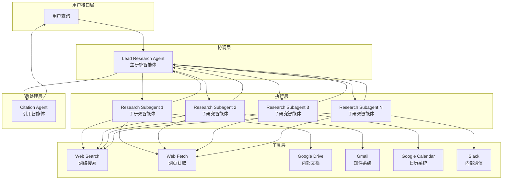
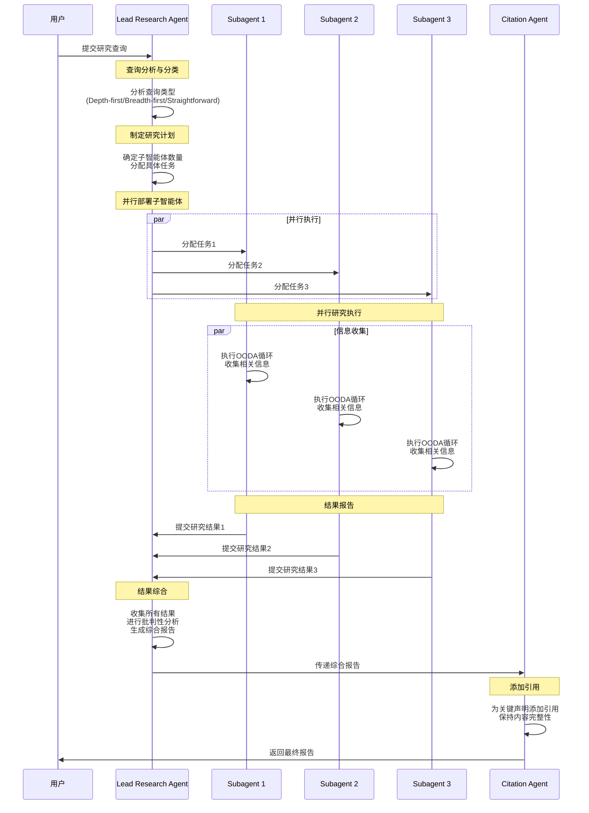
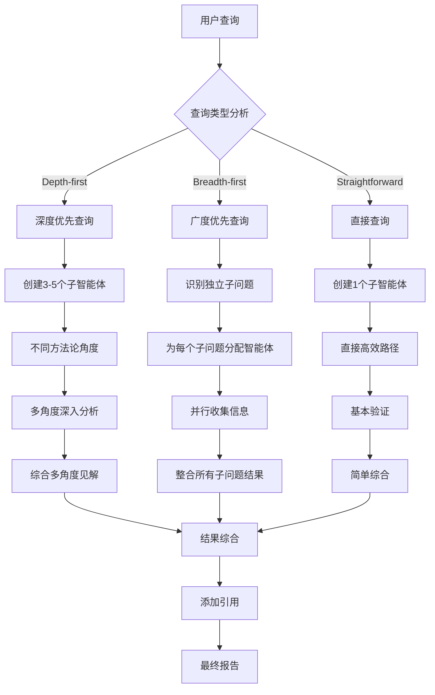
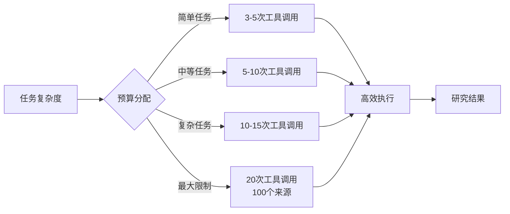
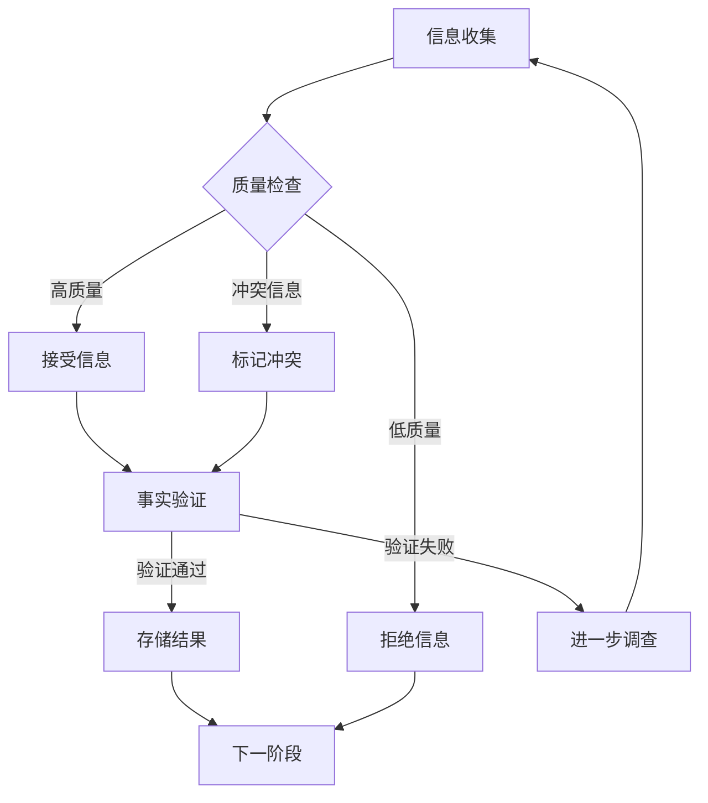

# Deep Research 智能体系统架构图

## 系统整体架构

## 智能体协作流程图

## 查询类型处理策略图

## 工具调用预算图

## 质量保证流程图

## 智能体角色职责矩阵

| 智能体类型 | 主要职责 | 关键能力 | 工具使用 | 输出格式 |
|-----------|---------|---------|---------|---------|
| **Lead Research Agent** | 策略制定、任务分配、结果综合 | 战略思维、并行管理、质量控制 | 子智能体管理工具 | 综合研究报告 |
| **Research Subagent** | 信息收集、初步分析 | 工具精通、信息筛选、效率控制 | 搜索工具、获取工具、内部工具 | 结构化研究结果 |
| **Citation Agent** | 引用添加、格式控制 | 精确性、一致性、完整性 | 引用处理工具 | 带引用的最终报告 |

## 系统特性总结

### 核心优势
- **并行高效**：多个子智能体同时工作，最大化研究效率
- **智能分配**：根据查询复杂度动态调整资源分配
- **质量保证**：多层次质量检查确保信息准确性
- **灵活适应**：支持不同类型查询的处理策略

### 技术特点
- **模块化设计**：各智能体职责清晰，便于维护和扩展
- **状态管理**：使用LangGraph管理复杂的状态流转
- **错误处理**：完善的错误恢复和优雅降级机制
- **成本控制**：智能的工具调用预算管理
