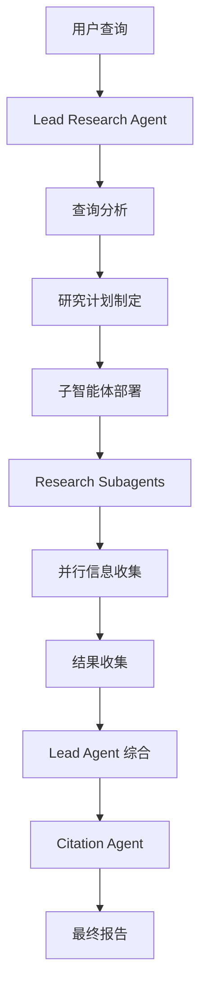

# Deep Research 多智能体系统设计分析

## 一、系统概述

基于 Anthropic 的智能体最佳实践，Deep Research 系统采用 **Orchestrator-Workers** 架构模式，通过一个主研究智能体（Lead Research Agent）协调多个子研究智能体（Research Subagents）和一个引用智能体（Citation Agent）来完成深度研究任务。

## 二、核心智能体角色分析

### 2.1 Lead Research Agent（主研究智能体）

#### 角色定位
- **系统协调者**：负责整体研究策略制定和任务分配
- **决策中心**：分析查询类型，制定研究计划，决定子智能体数量
- **质量把控者**：监控研究进度，综合结果，生成最终报告

#### 核心职责

1. **查询分析与分类**
   - 深度分析用户查询，识别关键概念和关系
   - 确定查询类型：
     - **Depth-first**：需要多角度深入分析同一问题
     - **Breadth-first**：需要并行研究多个独立子问题
     - **Straightforward**：简单直接的事实查找

2. **研究计划制定**
   - 根据查询类型制定详细研究策略
   - 确定子智能体数量和任务分配
   - 设计并行执行方案

3. **子智能体管理**
   - 创建和部署子智能体
   - 提供清晰的任务指令
   - 监控执行进度

4. **结果综合**
   - 收集和整合所有子智能体结果
   - 进行批判性分析和验证
   - 生成高质量的研究报告

#### 关键能力
- **战略思维**：能够从高层次分析问题并制定有效策略
- **并行管理**：同时管理多个子智能体，优化资源分配
- **质量控制**：确保研究结果的准确性和完整性
- **适应性**：根据中间结果调整研究策略

### 2.2 Research Subagent（研究子智能体）

#### 角色定位
- **专业执行者**：专注于特定研究任务的深度执行
- **信息收集者**：使用各种工具收集高质量信息
- **初步分析者**：对所收集信息进行初步整理和分析

#### 核心职责

1. **任务执行**
   - 接收主智能体分配的特定研究任务
   - 制定个人研究计划和工具调用预算
   - 执行 OODA 循环（观察-定位-决策-行动）

2. **信息收集**
   - 使用网络搜索工具获取信息片段
   - 使用网页获取工具获取完整内容
   - 优先使用内部工具（Google Drive、Gmail等）获取非公开信息

3. **质量评估**
   - 评估信息来源的可靠性和质量
   - 识别潜在的问题源（如新闻聚合器、推测性内容）
   - 记录信息冲突和不确定性

4. **结果报告**
   - 整理研究发现为结构化报告
   - 突出关键事实、数字和日期
   - 标记信息质量和潜在问题

#### 关键能力
- **工具精通**：熟练使用各种搜索和获取工具
- **信息筛选**：能够识别高质量和低质量信息源
- **效率控制**：在工具调用预算内完成任务
- **并行处理**：同时执行多个工具调用以提高效率

#### 工具调用预算
- **简单任务**：3-5次工具调用
- **中等任务**：5-10次工具调用
- **复杂任务**：10-15次工具调用
- **最大限制**：20次工具调用，100个来源

### 2.3 Citation Agent（引用智能体）

#### 角色定位
- **可信度增强者**：通过添加准确引用提升报告可信度
- **格式标准化者**：确保引用格式的一致性和正确性
- **内容保护者**：保持原始内容完整性，仅添加引用

#### 核心职责

1. **引用添加**
   - 为研究报告中的关键声明添加适当引用
   - 确保引用与源文档直接对应
   - 避免不必要的引用

2. **格式控制**
   - 保持原始文本100%不变
   - 仅在适当位置添加引用标签
   - 避免破坏句子结构和语义单元

3. **引用策略**
   - 优先引用关键事实、结论和实质性声明
   - 避免引用常识性内容
   - 最小化句子碎片化

#### 关键能力
- **精确性**：准确识别需要引用的内容
- **一致性**：保持引用格式和风格统一
- **完整性**：确保所有重要声明都有适当引用

## 三、智能体协作流程

### 3.1 整体工作流程

### 3.2 详细协作模式

#### Phase 1: 查询分析与规划
1. **Lead Agent** 接收用户查询
2. 进行深度分析，确定查询类型和复杂度
3. 制定研究计划，确定子智能体数量：
   - 简单查询：1个子智能体
   - 标准查询：2-3个子智能体
   - 中等复杂度：3-5个子智能体
   - 高复杂度：5-20个子智能体

#### Phase 2: 并行研究执行
1. **Lead Agent** 创建多个 **Research Subagents**
2. 每个子智能体接收特定任务指令
3. 子智能体并行执行研究任务
4. 使用各种工具收集信息

#### Phase 3: 结果综合
1. **Lead Agent** 收集所有子智能体结果
2. 进行批判性分析和验证
3. 综合信息生成研究报告
4. 确保信息完整性和准确性

#### Phase 4: 引用添加
1. **Citation Agent** 接收综合报告
2. 为关键声明添加适当引用
3. 保持原始内容完整性
4. 输出最终带引用的报告

### 3.3 智能体间通信

#### Lead Agent → Subagents
- **任务分配**：提供详细、具体的任务描述
- **上下文共享**：传递相关背景信息
- **工具指导**：指定应使用的工具类型
- **质量标准**：设定信息质量要求

#### Subagents → Lead Agent
- **进度报告**：报告研究进展和发现
- **问题反馈**：报告信息冲突或质量问题
- **结果提交**：提供结构化的研究发现

#### Lead Agent → Citation Agent
- **报告传递**：提供完整的综合报告
- **源信息**：提供所有相关源文档
- **格式要求**：指定引用格式要求

## 四、查询类型处理策略

### 4.1 Depth-first 查询
**特点**：需要从多个角度深入分析同一核心问题

**处理策略**：
- 创建3-5个子智能体，每个采用不同方法论
- 探索不同专家观点和证据来源
- 综合多角度见解形成全面分析

**示例**：
- "抑郁症最有效的治疗方法是什么？"
- "2008年金融危机的真正原因是什么？"

### 4.2 Breadth-first 查询
**特点**：可以分解为多个独立的子问题

**处理策略**：
- 识别所有可独立研究的子问题
- 为每个子问题分配专门子智能体
- 并行收集信息后整合

**示例**：
- "比较三个北欧国家的经济体系"
- "财富500强公司CEO的净资产和姓名"

### 4.3 Straightforward 查询
**特点**：聚焦、定义明确，可通过单一调查有效回答

**处理策略**：
- 创建1个子智能体进行协作
- 确定最直接、高效的答案路径
- 进行基本验证确保准确性

**示例**：
- "东京当前人口是多少？"
- "今年纳税截止日期是什么时候？"

## 五、质量保证机制

### 5.1 信息质量控制
- **来源评估**：优先使用原始来源，避免新闻聚合器
- **事实验证**：对关键数字、日期进行交叉验证
- **冲突处理**：记录信息冲突，基于来源质量进行判断

### 5.2 效率控制
- **工具预算**：为每个子智能体设定工具调用限制
- **早停机制**：当研究收益递减时及时停止
- **并行优化**：最大化并行工具调用

### 5.3 错误处理
- **优雅降级**：当某些信息不可用时提供替代方案
- **重试机制**：对可恢复错误进行重试
- **问题标记**：明确标记不确定或冲突的信息

## 六、技术实现要点

### 6.1 状态管理
- 使用 LangGraph 管理复杂的状态流转
- 实现检查点机制支持中断恢复
- 维护研究进度和中间结果

### 6.2 并行执行
- 异步创建和管理多个子智能体
- 实现高效的并行工具调用
- 优化资源分配和负载均衡

### 6.3 上下文管理
- 智能压缩上下文以节省token
- 为不同智能体提供适当的上下文
- 维护长期记忆和短期工作记忆

## 七、系统优势

### 7.1 可扩展性
- 根据查询复杂度动态调整子智能体数量
- 支持从简单查询到高复杂度研究任务
- 模块化设计便于功能扩展

### 7.2 效率性
- 并行执行最大化研究效率
- 智能任务分配避免重复工作
- 工具调用预算控制成本

### 7.3 质量保证
- 多层次质量检查机制
- 专业引用增强可信度
- 批判性思维确保准确性

### 7.4 适应性
- 根据查询类型采用不同策略
- 动态调整研究深度和广度
- 支持内部工具和外部信息源

## 八、总结

Deep Research 多智能体系统通过精心设计的角色分工和协作机制，实现了高效、准确、可扩展的深度研究能力。三个核心智能体各司其职，通过清晰的通信协议和协作流程，能够处理从简单事实查找到复杂多维度分析的各种研究任务。系统的模块化设计和质量保证机制确保了研究结果的可靠性和系统的可维护性。
