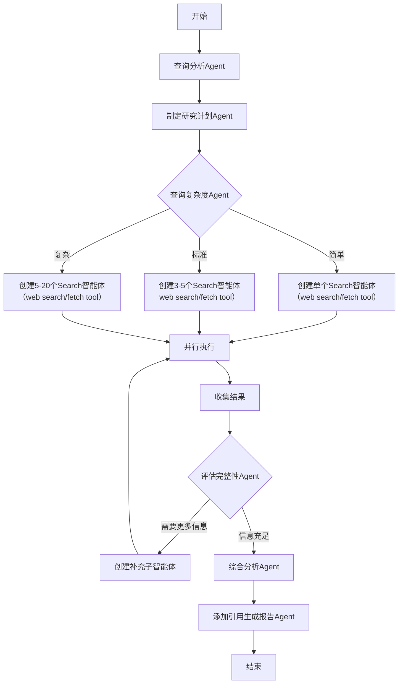
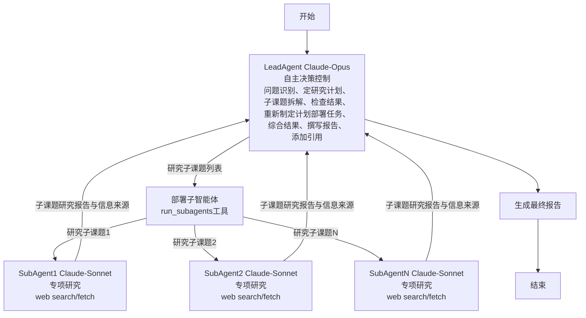

<!--
 * @Author: Chunlei Cai
 * @Date: 2025-09-08 15:22:49
 * @LastEditTime: 2025-09-08 15:38:05
 * @LastEditors: Chunlei Cai
 * @FilePath: /deep_research/docs/arch.md
 * @Description: 
-->

# 系统架构对比

## Workflow架构（基于步骤的流水线）

## React Agent架构（主从智能体）

