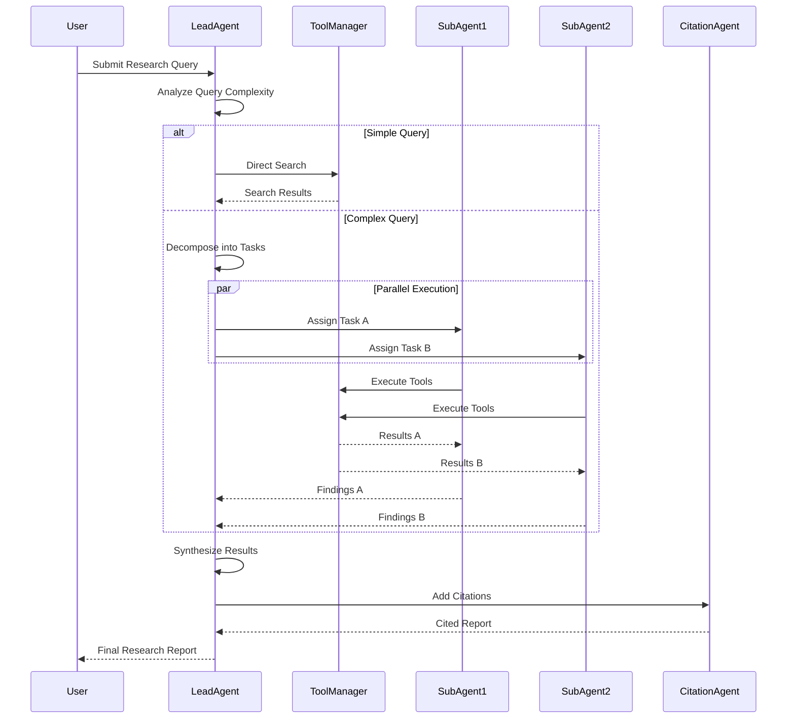
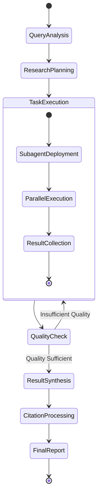
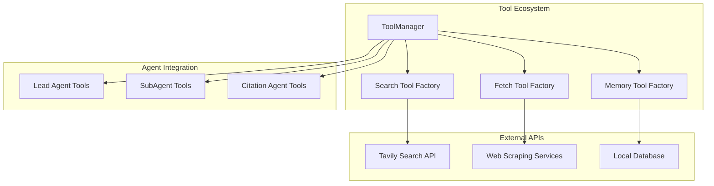

# Deep Research System - Implementation Guide

## System Overview

The Deep Research Multi-Agent System provides two distinct implementation approaches, each optimized for different use cases and operational requirements.

## Implementation Comparison

### React-Agent System vs Workflow System

| Aspect | React-Agent System | Workflow System |
|--------|-------------------|-----------------|
| **Architecture** | Autonomous decision-making agents | Structured state management |
| **Execution Model** | Real-time tool selection | Predefined workflow steps |
| **Flexibility** | High - agents adapt strategies | Medium - structured pipelines |
| **Predictability** | Variable execution paths | Consistent, reproducible results |
| **Resource Usage** | Higher token consumption | Optimized resource utilization |
| **Real-time Feedback** | Streaming updates | Batch progress reporting |
| **Error Recovery** | Multi-layered agent recovery | Checkpoint-based recovery |
| **Best For** | Interactive research, complex queries | Batch processing, enterprise workflows |

## React-Agent System Implementation

### Core Architecture Components

```python
# Main entry point - multi_reactagent.py
async def main():
    researcher = MultiAgentLeadResearcher()
    result = await researcher.research(query)
    return result

# Lead agent orchestration
class MultiAgentLeadResearcher:
    def __init__(self):
        self.llm = ChatAnthropic(model=config.lead_agent_model)
        self.agent = create_react_agent(
            model=self.llm,
            tools=self._get_tools(),
            prompt=self._get_lead_prompt()
        )
```

### Agent Coordination Flow



### Key Implementation Details

#### 1. Dynamic Task Allocation

```python
@tool
async def run_subagents(tasks: List[str]) -> List[Dict[str, Any]]:
    """Deploy multiple research subagents in parallel."""
    logger.info(f"🚀 Deploying {len(tasks)} subagents in parallel...")
    
    # Create subagents dynamically based on task count
    subagents = [
        ResearchSubAgent(agent_id=f"subagent_{i}")
        for i in range(len(tasks))
    ]
    
    # Execute all subagents concurrently
    results = await asyncio.gather(*[
        agent.research(task)
        for agent, task in zip(subagents, tasks)
    ])
    
    return results
```

#### 2. Real-time Streaming Implementation

```python
async def research(self, query: str) -> Dict[str, Any]:
    """Execute research with real-time streaming."""
    async for stream_node, chunk in self.agent.astream(
        {"messages": [{"role": "user", "content": query}]},
        config={"recursion_limit": 100},
        stream_mode=["values", "updates", "messages"]
    ):
        if stream_node == "updates":
            # Process agent decisions and tool calls
            await self._handle_agent_updates(chunk)
        elif stream_node == "messages":
            # Handle token-level streaming
            await self._handle_message_stream(chunk)
```

#### 3. Source Tracking and Citation

```python
def _extract_source_info_from_response(self, response: str, sources: List[str]):
    """Extract and enhance source information from agent responses."""
    title_pattern = r"Title:\s*([^\n]+)"
    titles = re.findall(title_pattern, response)
    
    # Convert string URLs to structured source objects
    for i, title in enumerate(titles):
        if i < len(sources) and isinstance(sources[i], str):
            sources[i] = {
                "url": sources[i],
                "title": title.strip(),
                "snippet": ""
            }
```

## Workflow System Implementation

### State Management Architecture

```python
# Workflow-based implementation - workflow_agent.py
class ResearchWorkflow:
    def __init__(self):
        self.workflow = self._create_workflow()
        self.state = ResearchState()
    
    def _create_workflow(self):
        workflow = StateGraph(ResearchState)
        workflow.add_node("analyze_query", self.analyze_query_node)
        workflow.add_node("plan_research", self.plan_research_node)
        workflow.add_node("execute_research", self.execute_research_node)
        workflow.add_node("synthesize_results", self.synthesize_results_node)
        return workflow
```

### Workflow State Transitions



## Tool Management Implementation

### Centralized Tool Architecture

```python
class ToolManager:
    """Centralized tool management for all agents."""
    
    def __init__(self):
        self._search_tool = None
        self._fetch_tool = None
        self._rate_limiter = RateLimiter()
    
    def create_web_search_tool(self, agent_type: str = "agent"):
        @tool
        async def web_search(query: str) -> str:
            # Rate limiting
            await self._rate_limiter.acquire()
            
            # Execute search with error handling
            try:
                result = await self.search_tool(query=query, max_results=5)
                return self._format_search_results(result)
            except Exception as e:
                return f"Search failed: {str(e)}"
        
        return web_search
```

### Tool Integration Patterns



## Performance Optimization Strategies

### 1. Model Selection Optimization

```python
# Lead Agent - Use Claude Opus for complex reasoning
self.lead_llm = ChatAnthropic(
    model="claude-3-5-sonnet-20241022",
    temperature=0.5,
    max_tokens=200000,
    timeout=3600
)

# SubAgents - Use Claude Sonnet for efficiency
self.subagent_llm = ChatAnthropic(
    model="claude-3-5-sonnet-20241022", 
    temperature=0.3,
    max_tokens=65536,
    timeout=300
)
```

### 2. Concurrency Management

```python
# Configure optimal concurrency levels
MAX_CONCURRENT_SUBAGENTS = 5  # Balance performance vs API limits
RECURSION_LIMIT = 100         # Allow deep reasoning chains
TIMEOUT_SECONDS = 300         # Prevent hanging operations
```

### 3. Memory and Caching

```python
class ToolManager:
    def __init__(self):
        # Singleton pattern for expensive resources
        self._search_tool = None
        self._fetch_tool = None
        
        # Result caching for repeated queries
        self._cache = TTLCache(maxsize=1000, ttl=3600)
    
    @cached_property
    def search_tool(self):
        if self._search_tool is None:
            self._search_tool = TavilyWebSearchTool()
        return self._search_tool
```

## Error Handling & Recovery Implementation

### Multi-level Error Handling

```python
async def research(self, task: str) -> Dict[str, Any]:
    """Execute research with comprehensive error handling."""
    try:
        # Primary execution path
        return await self._execute_research_task(task)
    
    except APITimeoutError as e:
        # Retry with exponential backoff
        logger.warning(f"API timeout, retrying: {e}")
        return await self._retry_with_backoff(task, e)
    
    except RateLimitError as e:
        # Handle rate limiting gracefully
        logger.info(f"Rate limited, waiting: {e}")
        await self._handle_rate_limit(e)
        return await self._retry_research(task)
    
    except Exception as e:
        # Graceful degradation with partial results
        logger.error(f"Research failed: {e}")
        return {
            "success": False,
            "error": str(e),
            "partial_results": self._get_partial_results()
        }
```

### Recovery Strategies

```python
class ErrorRecoveryManager:
    async def _retry_with_backoff(self, task: str, error: Exception):
        """Implement exponential backoff for retries."""
        for attempt in range(self.max_retries):
            wait_time = min(2 ** attempt, self.max_wait_time)
            await asyncio.sleep(wait_time)
            
            try:
                return await self._execute_research_task(task)
            except Exception as e:
                if attempt == self.max_retries - 1:
                    raise e
                continue
```

## Configuration Management

### Environment-based Configuration

```python
# src/utils/config.py
class Config:
    def __init__(self):
        # Model configuration
        self.lead_agent_model = os.getenv("LEAD_AGENT_MODEL", "claude-3-5-sonnet-20241022")
        self.subagent_model = os.getenv("SUBAGENT_MODEL", "claude-3-5-sonnet-20241022")
        
        # Execution limits  
        self.max_concurrent_subagents = int(os.getenv("MAX_CONCURRENT_SUBAGENTS", "5"))
        self.max_iterations = int(os.getenv("MAX_ITERATIONS", "5"))
        
        # API configuration
        self.anthropic_api_key = os.getenv("ANTHROPIC_API_KEY")
        self.tavily_api_key = os.getenv("TAVILY_API_KEY")
```

### Research Profiles

```python
# examples/configs/research_profiles.py
RESEARCH_PROFILES = {
    "academic": {
        "max_concurrent_subagents": 8,
        "max_iterations": 7,
        "quality_threshold": 0.85,
        "citation_style": "academic"
    },
    "business": {
        "max_concurrent_subagents": 12,
        "max_iterations": 5,
        "quality_threshold": 0.80,
        "citation_style": "business"
    }
}
```

## Testing Implementation

### Comprehensive Test Strategy

```python
# tests/unit/test_react_agents.py
class TestMultiAgentSystem:
    @pytest.mark.asyncio
    async def test_lead_agent_initialization(self):
        """Test lead agent proper initialization."""
        agent = MultiAgentLeadResearcher()
        assert agent.llm is not None
        assert len(agent.tools) > 0
    
    @pytest.mark.asyncio
    async def test_parallel_subagent_execution(self):
        """Test concurrent subagent deployment."""
        tasks = ["Task 1", "Task 2", "Task 3"]
        # Mock subagent execution
        results = await run_subagents(tasks)
        assert len(results) == len(tasks)
        
    @pytest.mark.asyncio
    async def test_error_recovery(self):
        """Test error handling and recovery mechanisms."""
        # Simulate API failures and test recovery
        pass
```

### Integration Testing

```python
# tests/integration/test_complete_flow.py
class TestCompleteResearchFlow:
    @pytest.mark.asyncio
    async def test_end_to_end_research(self):
        """Test complete research flow from query to report."""
        researcher = MultiAgentLeadResearcher()
        result = await researcher.research("Test query")
        
        assert result["success"] is True
        assert "report" in result
        assert len(result["report"]) > 0
```

## Deployment Considerations

### Production Deployment Checklist

1. **Environment Configuration**
   - [ ] API keys configured securely
   - [ ] Resource limits set appropriately  
   - [ ] Monitoring and logging enabled

2. **Performance Tuning**
   - [ ] Concurrency limits optimized for workload
   - [ ] Timeout values configured for infrastructure
   - [ ] Caching strategies implemented

3. **Error Handling**
   - [ ] Comprehensive error logging
   - [ ] Graceful degradation strategies
   - [ ] User-friendly error messages

4. **Monitoring**
   - [ ] Performance metrics collection
   - [ ] API usage tracking
   - [ ] Quality assessment metrics

### Scaling Considerations

```python
# Production configuration example
PRODUCTION_CONFIG = {
    "max_concurrent_subagents": 10,     # Scale based on API limits
    "agent_timeout": 600,               # 10 minutes for complex research
    "retry_attempts": 3,                # Balance reliability vs latency
    "cache_ttl": 3600,                 # 1 hour result caching
    "rate_limit_requests_per_minute": 60  # API provider limits
}
```

This implementation guide provides the foundation for understanding, deploying, and extending the Deep Research Multi-Agent System across different environments and use cases.