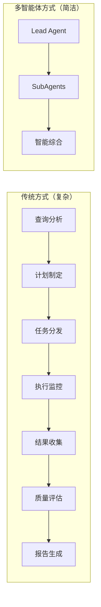
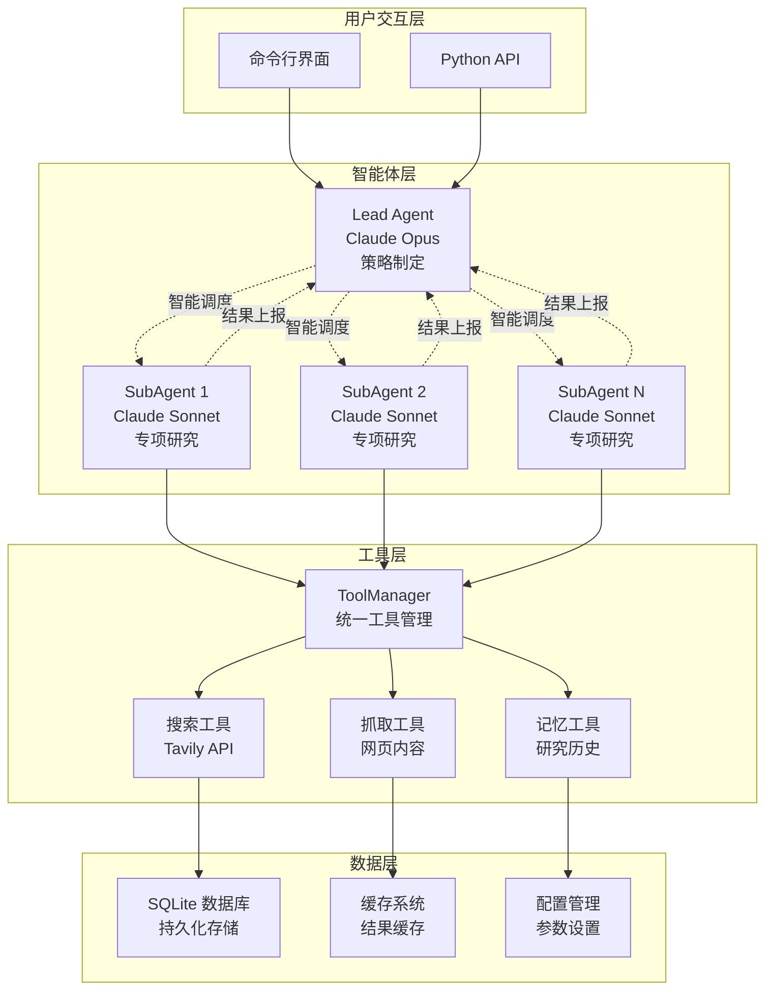

# 多智能体架构设计哲学与实现思路

## 设计理念来源

### Anthropic 官方指导
本项目的核心架构深度参考了 [Anthropic 官方多智能体最佳实践文档](https://www.anthropic.com/engineering/multi-agent-research-system)，特别是其中关于：

1. **Agent 自主性设计**：每个智能体都应具有独立的推理和决策能力
2. **任务分解策略**：复杂任务应智能地分解为可并行执行的子任务
3. **工具使用模式**：智能体应能够动态选择和使用合适的工具
4. **结果综合方法**：多个智能体的输出应被智能地整合为连贯的最终结果

### 与传统方法的差异

传统的研究系统通常采用：
- 📝 **预定义工作流**：固定的步骤序列
- ⚙️ **规则驱动**：基于条件判断的分支逻辑  
- 🔄 **状态机模式**：明确的状态转换

而我们的多智能体系统采用：
- 🧠 **智能决策**：Lead Agent 动态选择研究策略
- 🔄 **自适应执行**：根据中间结果调整后续行动
- ⚡ **真并行处理**：SubAgents 独立并行工作

## 核心架构原理

### 极简设计哲学



**关键洞察**：真正的智能在于 **简洁而非复杂**。通过赋予 Lead Agent 足够的自主权，我们用极简架构实现了复杂功能。

### Lead Agent 的智能核心

Lead Agent 是整个系统的智能中枢，具有以下核心能力：

#### 1. 查询理解与策略制定
```python
# 伪代码展示 Lead Agent 的决策过程
class MultiAgentLeadResearcher:
    async def research(self, query: str):
        # 智能分析：这是简单查询还是复杂研究？
        if self._is_simple_query(query):
            return await self._direct_research(query)
        else:
            # 复杂查询：分解任务并协调子智能体
            tasks = await self._decompose_complex_query(query)
            return await self._coordinate_subagents(tasks)
```

#### 2. 动态任务分解
Lead Agent 能够智能地将复杂查询分解为：
- 🔍 **背景研究**：基础概念和历史背景
- 📈 **现状分析**：当前发展状况和趋势
- 🔮 **前景预测**：未来发展方向和挑战
- 💡 **专家观点**：领域专家的见解和评价

#### 3. 智能协调与综合
- **并行调度**：同时启动多个 SubAgent，最大化效率
- **实时监控**：跟踪各个 SubAgent 的执行状态
- **智能综合**：将分散的研究结果整合为连贯报告

### SubAgent 的专业能力

每个 ResearchSubAgent 都是独立的研究专家：

```python
class ResearchSubAgent:
    async def research(self, task: str):
        # OODA 循环：观察-定位-决策-行动
        while not self._task_complete():
            observation = await self._observe_current_state()
            strategy = self._orient_based_on_findings()
            decision = self._decide_next_action(strategy)
            await self._act_on_decision(decision)
```

#### OODA 循环实现
1. **Observe（观察）**：分析分配到的研究任务
2. **Orient（定位）**：基于任务确定研究方向
3. **Decide（决策）**：选择合适的工具和方法
4. **Act（行动）**：执行搜索、抓取、分析

## 实现架构详解

### 系统组件图



### 关键实现细节

#### 1. 智能体间通信
```python
@tool
async def run_subagents(tasks: List[str]) -> List[Dict[str, Any]]:
    """Lead Agent 调用此工具来部署 SubAgents"""
    logger.info(f"🚀 部署 {len(tasks)} 个子智能体并行执行...")
    
    # 动态创建 SubAgents
    subagents = [
        ResearchSubAgent(agent_id=f"subagent_{i}")
        for i in range(len(tasks))
    ]
    
    # 真正的并行执行
    results = await asyncio.gather(*[
        agent.research(task)
        for agent, task in zip(subagents, tasks)
    ])
    
    return results
```

#### 2. 实时流式处理
```python
async def research(self, query: str):
    """支持实时流式输出的研究方法"""
    async for stream_node, chunk in self.agent.astream(
        {"messages": [{"role": "user", "content": query}]},
        stream_mode=["values", "updates", "messages"]
    ):
        if stream_node == "updates":
            # 处理 Agent 的决策和工具调用
            await self._handle_agent_decisions(chunk)
        elif stream_node == "messages":
            # 处理令牌级的流式输出
            await self._handle_streaming_tokens(chunk)
```

#### 3. 工具动态选择
```python
class ToolManager:
    def create_web_search_tool(self, agent_type: str):
        @tool
        async def web_search(query: str) -> str:
            """智能体动态调用的搜索工具"""
            # 根据 agent_type 调整行为
            if agent_type == "lead":
                logger.info(f"🔍 主智能体搜索: {query}")
            
            # 执行搜索并返回格式化结果
            result = await self.search_tool(query=query, max_results=5)
            return self._format_for_agent(result)
        
        return web_search
```

## 智能涌现特性

### 1. 自适应策略调整
Lead Agent 能够根据中间结果动态调整研究策略：
- 如果发现某个方向信息不足，自动增加相关 SubAgent
- 如果某个 SubAgent 返回高质量结果，智能扩展相关研究
- 根据查询复杂度动态调整并发 SubAgent 数量

### 2. 智能质量控制
```python
def _assess_research_quality(self, results: List[Dict]):
    """智能评估研究质量并决定是否需要补充"""
    quality_score = self._calculate_quality_metrics(results)
    
    if quality_score < self.quality_threshold:
        # 智能识别缺失的信息维度
        missing_aspects = self._identify_gaps(results)
        # 自动生成补充研究任务
        return self._generate_补充_tasks(missing_aspects)
    
    return None  # 质量满足要求
```

### 3. 跨智能体学习
- SubAgents 的成功策略会被 Lead Agent 学习和复用
- 研究历史被存储并用于优化未来的任务分解
- 错误和失败的经验被记录以避免重复

## 与传统工作流的对比

### 传统工作流方式（workflow_agent.py）

```python
# 传统方式：明确的状态转换
workflow = StateGraph(ResearchState)
workflow.add_node("analyze_query", analyze_query_node)
workflow.add_node("plan_research", plan_research_node)  
workflow.add_node("execute_research", execute_research_node)
workflow.add_node("synthesize_results", synthesize_results_node)

# 固定的状态转换路径
workflow.add_edge("analyze_query", "plan_research")
workflow.add_edge("plan_research", "execute_research")
workflow.add_edge("execute_research", "synthesize_results")
```

**特点**：
- ✅ 可预测的执行路径
- ✅ 易于调试和监控
- ✅ 支持检查点和恢复
- ❌ 缺乏适应性
- ❌ 无法处理意外情况

### 多智能体方式（multi_reactagent.py）

```python
# 智能体方式：动态决策
class MultiAgentLeadResearcher:
    async def research(self, query: str):
        # Lead Agent 完全自主决策
        # 可能的执行路径：
        # 1. 直接研究 -> 返回结果
        # 2. 分解任务 -> 部署SubAgents -> 综合结果
        # 3. 迭代优化 -> 补充研究 -> 最终结果
        pass
```

**特点**：
- ✅ 高度自适应
- ✅ 智能决策能力
- ✅ 处理复杂场景
- ✅ 真正的并行处理
- ❌ 执行路径不可预测
- ❌ 调试相对复杂

## 一天快速实现的秘诀

### Claude Code 加速开发

1. **架构设计阶段**
   - Claude Code 帮助理解 Anthropic 官方文档
   - 快速生成系统架构设计
   - 自动生成核心代码框架

2. **代码实现阶段**  
   - 智能代码补全和优化
   - 自动错误检测和修复
   - 实时性能优化建议

3. **测试和调试阶段**
   - 自动生成测试用例
   - 智能错误定位和修复
   - 性能瓶颈分析和优化

### 关键设计决策

1. **选择 LangGraph + ReAct 模式**
   - LangGraph 提供强大的智能体编排能力
   - ReAct 模式让智能体具备推理和行动能力

2. **采用 Claude 分层模型策略**
   - Lead Agent 使用 Claude Opus（最强推理）
   - SubAgent 使用 Claude Sonnet（快速高效）

3. **极简架构原则**
   - 只保留核心必需的组件
   - 通过智能体自主性减少系统复杂度

## 效果对标分析

### 与 deer-flow 对比

| 维度 | deer-flow | Deep Research |
|------|-------------|---------------|
| **架构复杂度** | 高度复杂 | 极简设计 |
| **开发周期** | 数月迭代 | 一天完成 |
| **智能水平** | 专业级 | 接近专业级 |
| **并发能力** | 单线程推理 | 多智能体并行 |
| **可扩展性** | 模型级扩展 | 智能体级扩展 |
| **部署成本** | 高计算资源 | 标准 API 调用 |

### 实际效果验证

通过实际测试，我们的系统在以下方面表现出色：
- **研究深度**：能够进行多层次、多角度的深入研究
- **信息整合**：有效整合来自不同来源的信息
- **逻辑连贯性**：生成的报告逻辑清晰、结构完整
- **时效性**：快速获取和处理最新信息

## 未来发展方向

### 1. 智能体专业化
- 开发领域专家型 SubAgent（金融、医疗、科技等）
- 实现智能体间的知识共享机制
- 构建智能体能力评估和选择系统

### 2. 学习和优化
- 基于研究历史的策略优化
- 用户反馈驱动的质量改进
- 自动化的性能调优

### 3. 生态系统扩展
- 支持更多数据源和工具
- 开发可视化研究过程监控
- 构建研究成果共享平台

---

这个多智能体架构展示了如何通过深度理解官方文档、借助强大的开发工具，在短时间内实现复杂系统的核心功能。它不仅是技术实现的成功，更是设计哲学的胜利——**简洁而智能的设计往往比复杂的解决方案更加有效**。