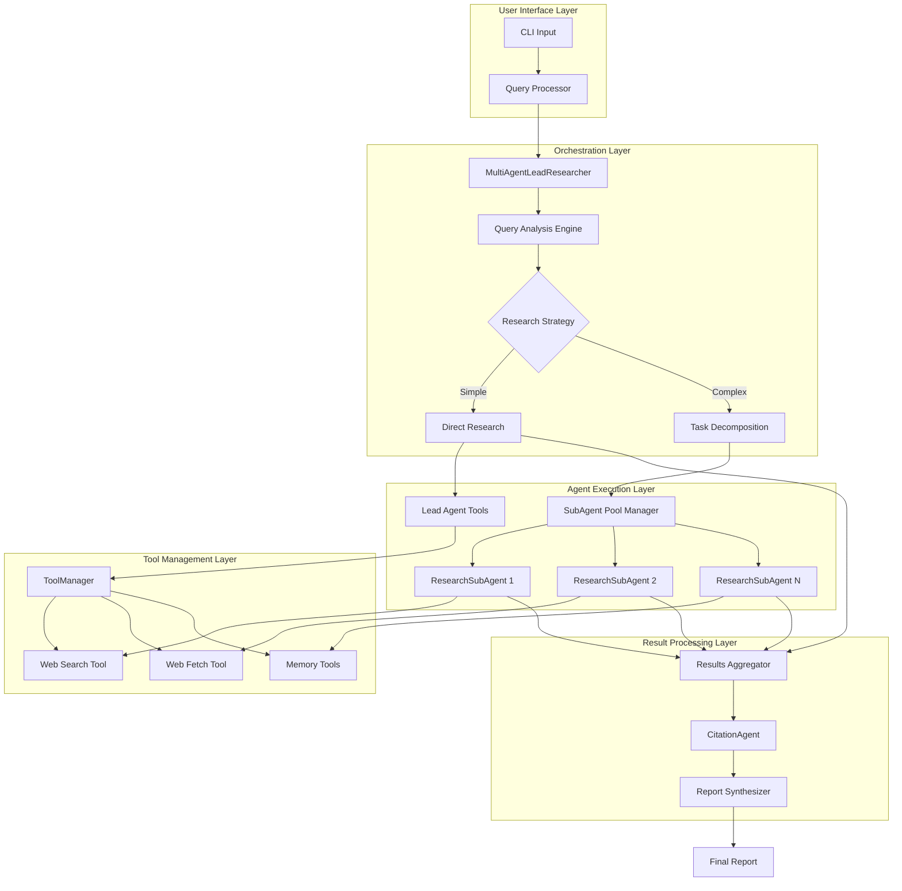
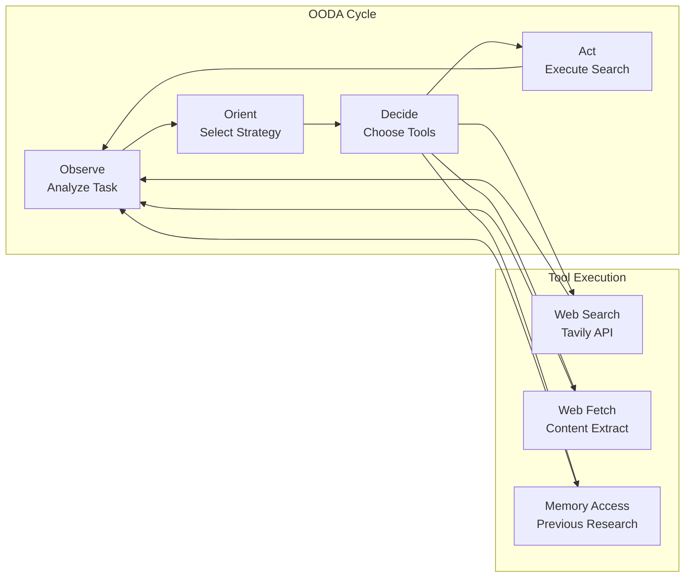
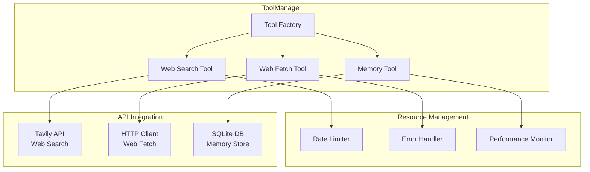
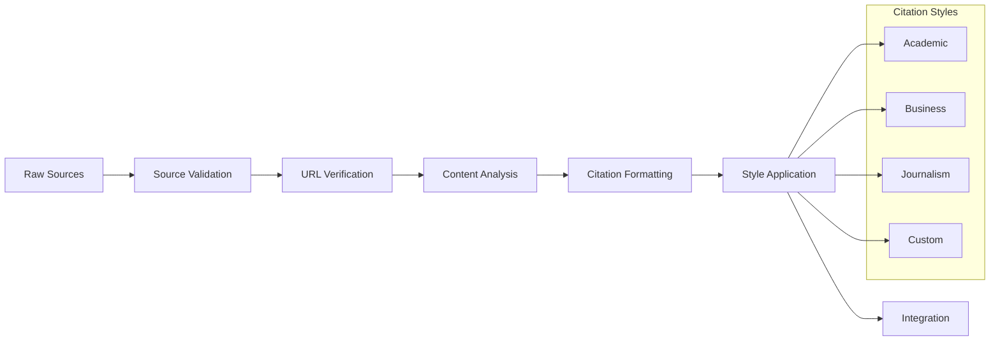
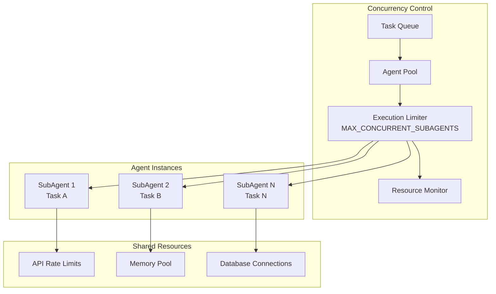
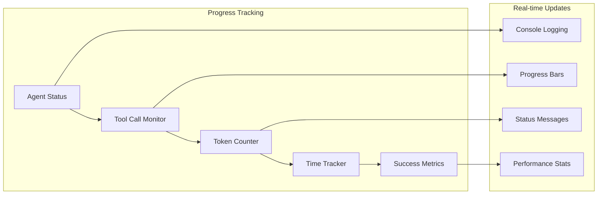
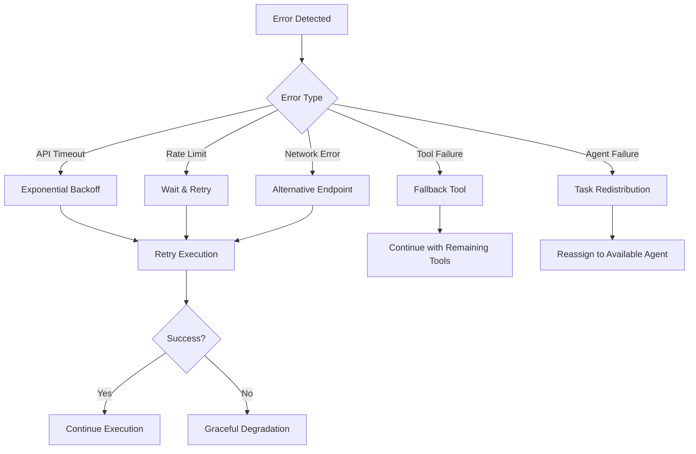

# React-Agent System Architecture & Implementation

## Overview

The React-Agent system (`src/react_agents/multi_agent_system.py`) represents the autonomous decision-making implementation of the Deep Research system. Unlike the workflow-based approach, React-Agents make independent decisions about tool usage, research strategies, and task execution in real-time.

## Architecture Philosophy

### ReAct Pattern (Reasoning + Acting)
The system implements the ReAct pattern where agents:
1. **Reason** about the current state and required actions
2. **Act** by selecting and executing appropriate tools
3. **Observe** the results of their actions
4. **Repeat** the cycle until the task is complete

This creates truly autonomous agents that can adapt their research strategy based on intermediate findings.

## System Architecture

### High-Level Component Flow



## Core Components Deep Dive

### 1. MultiAgentLeadResearcher

**Purpose**: Master orchestrator and primary decision-making entity

**Key Responsibilities**:
- Query analysis and research strategy determination
- Task decomposition for complex queries
- Subagent coordination and parallel execution management
- Results synthesis and quality assessment

**Implementation Details**:
```python
class MultiAgentLeadResearcher:
    def __init__(self):
        # Use Claude Opus for superior reasoning capabilities
        self.llm = ChatAnthropic(model="claude-3-5-sonnet-20241022")
        self.tools = self._get_tools()
        self.agent = create_react_agent(
            model=self.llm,
            tools=self.tools,
            prompt=self._get_lead_prompt()
        )
```

**Decision-Making Process**:
1. **Query Analysis**: Determines complexity and research approach needed
2. **Strategy Selection**: Chooses between direct research or subagent deployment
3. **Task Generation**: Breaks complex queries into focused sub-tasks
4. **Agent Coordination**: Manages parallel subagent execution
5. **Result Synthesis**: Combines findings into coherent reports

### 2. ResearchSubAgent

**Purpose**: Specialized research workers for focused task execution

**Key Characteristics**:
- Independent ReAct agents with full tool access
- Claude Sonnet models for fast, efficient processing
- OODA loop execution for systematic research
- Source tracking and metadata collection

**OODA Loop Implementation**:



**Execution Flow**:
```python
async def research(self, task: str) -> Dict[str, Any]:
    # Observe: Analyze the assigned task
    # Orient: Determine research approach
    # Decide: Select appropriate tools
    # Act: Execute search and analysis
    
    findings = ""
    sources = []
    
    # Stream execution with real-time monitoring
    async for chunk in self.agent.astream():
        # Process tool calls and responses
        # Extract sources and findings
        # Update progress tracking
    
    return {
        "findings": findings,
        "sources": sources,
        "success": True
    }
```

### 3. ToolManager

**Purpose**: Centralized tool orchestration and resource management

**Architecture**:



**Tool Creation Pattern**:
```python
class ToolManager:
    def create_web_search_tool(self, agent_type: str) -> callable:
        @tool
        async def web_search(query: str) -> str:
            # Rate limiting
            # API call execution
            # Result formatting
            # Error handling
            return formatted_results
        
        return web_search
```

### 4. CitationAgent

**Purpose**: Dedicated citation processing and source management

**Citation Processing Pipeline**:



## Parallel Execution Architecture

### SubAgent Coordination

The system uses `asyncio.gather()` for true parallel execution:

```python
async def run_subagents(tasks: List[str]) -> List[Dict[str, Any]]:
    # Create subagent instances
    subagents = [
        ResearchSubAgent(agent_id=f"subagent_{i}")
        for i in range(len(tasks))
    ]
    
    # Execute all subagents in parallel
    results = await asyncio.gather(*[
        agent.research(task)
        for agent, task in zip(subagents, tasks)
    ])
    
    return results
```

### Concurrency Management



## Real-time Streaming & Progress Tracking

### Streaming Architecture

```python
# Lead Agent streaming
async for stream_node, chunk in self.agent.astream(
    {"messages": [{"role": "user", "content": query}]},
    config={"recursion_limit": 100},
    stream_mode=["values", "updates", "messages"]
):
    if stream_node == "updates":
        # Process agent decisions and tool calls
        # Log real-time progress
        # Update user interface
    elif stream_node == "messages":
        # Handle token-level streaming
        # Provide live feedback
```

### Progress Monitoring



## Error Handling & Recovery

### Multi-layered Error Handling

```python
class ResearchSubAgent:
    async def research(self, task: str) -> Dict[str, Any]:
        try:
            # Primary execution path
            result = await self._execute_research(task)
            return result
        except APITimeout as e:
            # Retry with exponential backoff
            return await self._retry_research(task, e)
        except APIRateLimit as e:
            # Wait and retry with rate limiting
            await self._handle_rate_limit(e)
            return await self._retry_research(task, e)
        except Exception as e:
            # Graceful degradation
            logger.error(f"SubAgent failed: {e}")
            return {
                "success": False,
                "error": str(e),
                "fallback_available": True
            }
```

### Recovery Strategies



## Performance Optimizations

### 1. Model Selection Strategy
- **Lead Agent**: Claude Opus for complex reasoning and coordination
- **SubAgents**: Claude Sonnet for fast, efficient task execution
- **Citation Agent**: Claude Sonnet for structured text processing

### 2. Async Processing
- Full async/await implementation
- Parallel subagent execution
- Non-blocking I/O operations
- Efficient resource utilization

### 3. Caching & Memory Management
```python
class ToolManager:
    def __init__(self):
        self._search_tool = None  # Lazy initialization
        self._fetch_tool = None   # Singleton pattern
        self._cache = {}         # Result caching
    
    @property
    def search_tool(self):
        if self._search_tool is None:
            self._search_tool = TavilyWebSearchTool()
        return self._search_tool
```

### 4. Resource Monitoring
- API usage tracking
- Token consumption monitoring  
- Execution time measurement
- Memory usage optimization

## Implementation Benefits

### Advantages of React-Agent Approach

1. **Autonomous Decision Making**: Agents make real-time decisions about research strategy
2. **Adaptive Execution**: Can pivot strategies based on intermediate findings
3. **True Parallelism**: Independent agents working simultaneously  
4. **Scalable Architecture**: Easy to add new agent types and tools
5. **Real-time Feedback**: Streaming updates and progress monitoring
6. **Error Resilience**: Multiple layers of error handling and recovery

### Trade-offs

1. **Complexity**: More sophisticated than workflow-based systems
2. **Resource Usage**: Higher token consumption due to agent reasoning
3. **Unpredictability**: Research paths may vary between executions
4. **Debugging**: More challenging to trace execution paths

## Usage Patterns

### When to Use React-Agent System

✅ **Ideal for**:
- Interactive research sessions
- Complex, multi-faceted queries
- Real-time analysis requirements
- Adaptive research strategies
- Exploratory research tasks

❌ **Avoid for**:
- Simple, straightforward queries
- Reproducible research pipelines  
- Budget-constrained scenarios
- Highly structured workflows

## Future Enhancements

### Planned Improvements

1. **Agent Specialization**: Domain-specific agent types
2. **Learning Mechanisms**: Agents learn from previous research
3. **Advanced Coordination**: More sophisticated inter-agent communication
4. **Performance Optimization**: Smarter resource allocation
5. **Quality Assessment**: Automated research quality evaluation

This React-Agent implementation represents the cutting edge of autonomous multi-agent research systems, providing unparalleled flexibility and intelligence in information gathering and synthesis tasks.