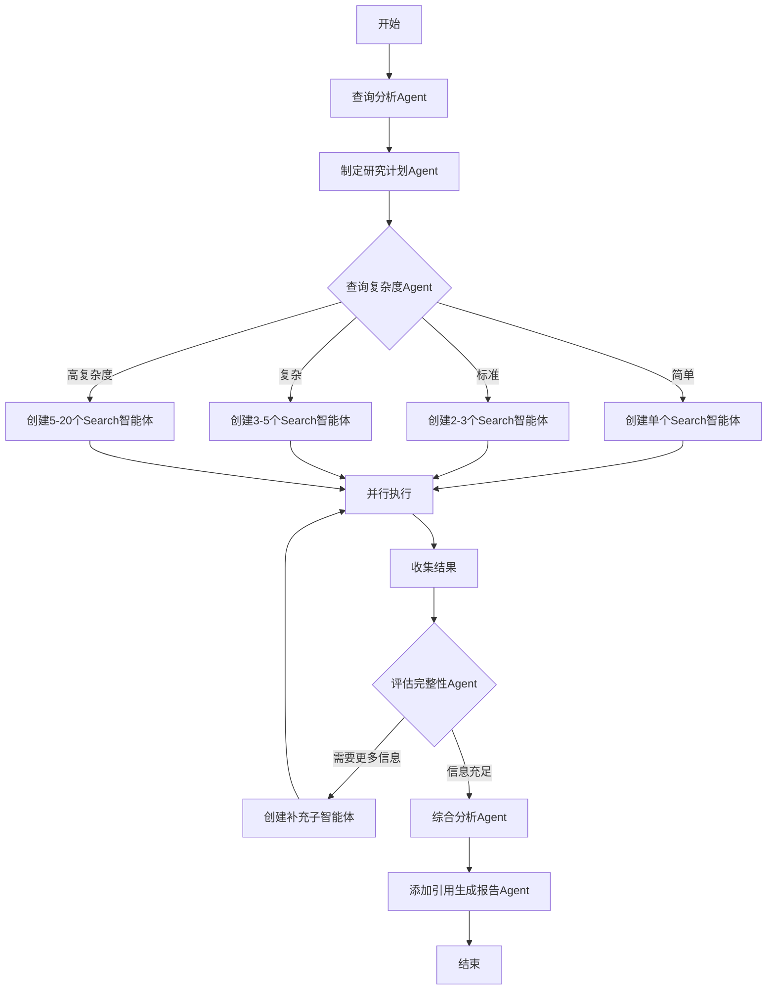

# Deep Research 多智能体系统技术实现计划

## 一、系统概述

基于 Anthropic 的最佳实践和提供的智能体提示词，我们将使用 LangGraph 框架构建一个高效、可扩展的多智能体研究系统。系统采用 Orchestrator-Workers 架构模式，通过并行化和智能任务分配实现高效的深度研究。

## 二、顶层架构设计

### 2.1 架构原则
- **简单性优先**：从最简单的实现开始，逐步增加复杂性
- **模块化设计**：每个组件职责单一，易于测试和维护
- **可观察性**：完整的日志和追踪系统
- **容错性**：优雅的错误处理和恢复机制

### 2.2 系统架构图

```
┌─────────────────────────────────────────────────────────────┐
│                        用户接口层                              │
│                   (API / CLI / Web Interface)                │
└────────────────┬────────────────────────────────────────────┘
                 │
┌────────────────▼────────────────────────────────────────────┐
│                      LangGraph 协调层                         │
│  ┌──────────────────────────────────────────────────────┐   │
│  │                  StateGraph Manager                   │   │
│  │         (状态管理、流程控制、检查点恢复)                   │   │
│  └──────────────────────────────────────────────────────┘   │
└────────────────┬────────────────────────────────────────────┘
                 │
┌────────────────▼────────────────────────────────────────────┐
│                       智能体执行层                            │
│  ┌──────────────┐  ┌──────────────┐  ┌──────────────┐     │
│  │Lead Research │  │  Subagents   │  │  Citations   │     │
│  │    Agent     │  │   (1-20个)    │  │    Agent     │     │
│  └──────────────┘  └──────────────┘  └──────────────┘     │
└────────────────┬────────────────────────────────────────────┘
                 │
┌────────────────▼────────────────────────────────────────────┐
│                        工具与资源层                           │
│  ┌────────┐ ┌────────┐ ┌────────┐ ┌────────┐ ┌────────┐  │
│  │Web     │ │Google  │ │Memory  │ │Internal│ │Analysis│  │
│  │Search  │ │Suite   │ │Store   │ │Tools   │ │Tools   │  │
│  └────────┘ └────────┘ └────────┘ └────────┘ └────────┘  │
└─────────────────────────────────────────────────────────────┘
```

## 三、LangGraph 流程设计

### 3.1 主要节点（Nodes）

```python
# 节点定义
nodes = {
    "start": "初始化和查询分析",
    "plan": "研究计划制定", 
    "dispatch": "子智能体任务分配",
    "execute": "并行执行研究任务",
    "synthesize": "结果综合与分析",
    "evaluate": "质量评估",
    "cite": "添加引用",
    "complete": "生成最终报告"
}
```

### 3.2 状态流转图



### 3.3 LangGraph 状态定义

```python
from typing import TypedDict, List, Dict, Optional, Annotated
from langgraph.graph import StateGraph, END
import operator

class ResearchState(TypedDict):
    # 用户输入
    query: str
    query_type: str  # depth-first, breadth-first, straightforward
    
    # 研究计划
    research_plan: Dict
    subagent_count: int
    subagent_tasks: List[Dict]
    
    # 执行状态
    active_subagents: List[str]
    completed_subagents: List[str]
    failed_subagents: List[str]
    
    # 研究结果
    raw_results: List[Dict]
    synthesized_text: str
    cited_text: str
    
    # 记忆和上下文
    memory: Dict
    context_tokens: int
    
    # 控制流
    iteration: int
    max_iterations: int
    should_continue: bool
    error_state: Optional[str]
```

## 四、核心类设计

### 4.1 基础类结构

```python
# base.py - 基础类
class BaseAgent:
    """所有智能体的基类"""
    def __init__(self, llm, tools, memory_store):
        self.llm = llm
        self.tools = tools
        self.memory = memory_store
        self.token_count = 0
        
    async def think(self, context: str) -> str:
        """Extended thinking mode"""
        pass
        
    async def act(self, task: str) -> Dict:
        """执行任务"""
        pass

# lead_agent.py
class LeadResearchAgent(BaseAgent):
    """主研究智能体"""
    def __init__(self, *args, **kwargs):
        super().__init__(*args, **kwargs)
        self.subagent_manager = SubagentManager()
        
    async def analyze_query(self, query: str) -> Dict:
        """分析查询类型和复杂度"""
        pass
        
    async def create_research_plan(self, analysis: Dict) -> Dict:
        """创建研究计划"""
        pass
        
    async def dispatch_subagents(self, plan: Dict) -> List[str]:
        """派发子智能体任务"""
        pass
        
    async def synthesize_results(self, results: List[Dict]) -> str:
        """综合研究结果"""
        pass

# subagent.py
class ResearchSubagent(BaseAgent):
    """研究子智能体"""
    def __init__(self, task_description: str, *args, **kwargs):
        super().__init__(*args, **kwargs)
        self.task = task_description
        self.tool_call_budget = self._calculate_budget()
        
    def _calculate_budget(self) -> int:
        """根据任务复杂度计算工具调用预算"""
        # 简单: 3-5, 中等: 5-10, 复杂: 10-15
        pass
        
    async def execute_research(self) -> Dict:
        """执行研究任务"""
        pass
        
    async def ooda_loop(self) -> Dict:
        """OODA循环: 观察-定位-决策-行动"""
        pass

# citation_agent.py
class CitationAgent(BaseAgent):
    """引用智能体"""
    async def add_citations(self, text: str, sources: List[Dict]) -> str:
        """为文本添加引用"""
        pass
```

### 4.2 管理器类

```python
# managers.py
class SubagentManager:
    """子智能体管理器"""
    def __init__(self, max_concurrent: int = 5):
        self.max_concurrent = max_concurrent
        self.active_agents = {}
        self.completed_agents = {}
        
    async def create_subagent(self, task: Dict) -> str:
        """创建子智能体"""
        pass
        
    async def run_parallel(self, tasks: List[Dict]) -> List[Dict]:
        """并行运行多个子智能体"""
        pass
        
    async def monitor_progress(self) -> Dict:
        """监控执行进度"""
        pass

class MemoryManager:
    """记忆管理器"""
    def __init__(self, max_tokens: int = 200000):
        self.max_tokens = max_tokens
        self.memory_store = {}
        self.current_tokens = 0
        
    async def save_to_memory(self, key: str, value: Any) -> None:
        """保存到记忆"""
        pass
        
    async def retrieve_from_memory(self, key: str) -> Any:
        """从记忆检索"""
        pass
        
    async def compress_context(self) -> None:
        """压缩上下文"""
        pass

class ToolManager:
    """工具管理器"""
    def __init__(self):
        self.tools = self._initialize_tools()
        self.tool_usage_stats = {}
        
    def _initialize_tools(self) -> Dict:
        """初始化所有工具"""
        return {
            "web_search": WebSearchTool(),
            "web_fetch": WebFetchTool(),
            "google_drive": GoogleDriveTool(),
            "memory_store": MemoryStoreTool(),
            # ... 其他工具
        }
```

## 五、工具设计

### 5.1 工具接口规范

```python
# tools/base.py
from abc import ABC, abstractmethod

class BaseTool(ABC):
    """工具基类"""
    def __init__(self):
        self.name = ""
        self.description = ""
        self.parameters = {}
        self.usage_count = 0
        
    @abstractmethod
    async def execute(self, **kwargs) -> Dict:
        """执行工具"""
        pass
        
    def validate_params(self, **kwargs) -> bool:
        """验证参数"""
        pass
        
    def format_output(self, result: Any) -> Dict:
        """格式化输出"""
        return {
            "success": True,
            "data": result,
            "tool": self.name,
            "timestamp": datetime.now()
        }
```

### 5.2 核心工具实现

```python
# tools/search.py
class WebSearchTool(BaseTool):
    """网络搜索工具"""
    def __init__(self):
        super().__init__()
        self.name = "web_search"
        self.description = "搜索网络获取信息片段"
        
    async def execute(self, query: str, max_results: int = 10) -> Dict:
        # 实现搜索逻辑
        pass

# tools/fetch.py  
class WebFetchTool(BaseTool):
    """网页获取工具"""
    def __init__(self):
        super().__init__()
        self.name = "web_fetch"
        self.description = "获取完整网页内容"
        
    async def execute(self, url: str) -> Dict:
        # 实现网页抓取
        pass

# tools/memory.py
class MemoryStoreTool(BaseTool):
    """记忆存储工具"""
    def __init__(self):
        super().__init__()
        self.name = "memory_store"
        self.storage = {}
        
    async def save(self, key: str, value: Any) -> Dict:
        pass
        
    async def retrieve(self, key: str) -> Dict:
        pass
```

## 六、上下文管理策略

### 6.1 上下文窗口管理

```python
class ContextManager:
    """上下文管理器"""
    def __init__(self, max_tokens: int = 200000):
        self.max_tokens = max_tokens
        self.current_tokens = 0
        self.context_queue = deque()
        
    async def add_to_context(self, content: str, priority: int = 0) -> None:
        """添加到上下文"""
        tokens = self._count_tokens(content)
        
        if self.current_tokens + tokens > self.max_tokens:
            await self._compress_context()
            
        self.context_queue.append({
            "content": content,
            "tokens": tokens,
            "priority": priority,
            "timestamp": datetime.now()
        })
        self.current_tokens += tokens
        
    async def _compress_context(self) -> None:
        """压缩上下文"""
        # 1. 总结已完成的工作阶段
        # 2. 存储关键信息到外部记忆
        # 3. 保留高优先级内容
        pass
        
    async def get_context_for_agent(self, agent_type: str) -> str:
        """获取特定智能体的上下文"""
        pass
```

### 6.2 子智能体上下文隔离

```python
class SubagentContext:
    """子智能体上下文"""
    def __init__(self, task: str, parent_context: str):
        self.task = task
        self.parent_context = self._extract_relevant(parent_context)
        self.local_context = []
        
    def _extract_relevant(self, context: str) -> str:
        """提取相关上下文"""
        # 只传递与任务相关的上下文
        pass
```

## 七、记忆管理系统

### 7.1 分层记忆架构

```python
class HierarchicalMemory:
    """分层记忆系统"""
    def __init__(self):
        self.short_term = {}  # 短期记忆（当前会话）
        self.working = {}     # 工作记忆（当前任务）
        self.long_term = {}   # 长期记忆（跨会话）
        
    async def store(self, key: str, value: Any, level: str = "working") -> None:
        """存储记忆"""
        memory_map = {
            "short": self.short_term,
            "working": self.working,
            "long": self.long_term
        }
        memory_map[level][key] = {
            "value": value,
            "timestamp": datetime.now(),
            "access_count": 0
        }
        
    async def retrieve(self, key: str) -> Any:
        """检索记忆（从所有层级）"""
        for memory in [self.short_term, self.working, self.long_term]:
            if key in memory:
                memory[key]["access_count"] += 1
                return memory[key]["value"]
        return None
        
    async def consolidate(self) -> None:
        """记忆巩固（从短期到长期）"""
        pass
```

### 7.2 研究计划持久化

```python
class ResearchPlanMemory:
    """研究计划记忆"""
    def __init__(self):
        self.plans = {}
        
    async def save_plan(self, query_id: str, plan: Dict) -> None:
        """保存研究计划"""
        self.plans[query_id] = {
            "plan": plan,
            "created_at": datetime.now(),
            "status": "active"
        }
        
    async def update_progress(self, query_id: str, progress: Dict) -> None:
        """更新进度"""
        if query_id in self.plans:
            self.plans[query_id]["progress"] = progress
            self.plans[query_id]["updated_at"] = datetime.now()
```

## 八、评估体系

### 8.1 三层评估架构

```python
class EvaluationSystem:
    """评估系统"""
    def __init__(self):
        self.small_sample_eval = SmallSampleEvaluator()
        self.llm_judge = LLMJudgeEvaluator()
        self.human_eval = HumanEvaluator()
        
    async def evaluate(self, result: Dict, level: str = "auto") -> Dict:
        """执行评估"""
        scores = {}
        
        if level in ["small", "auto"]:
            scores["small_sample"] = await self.small_sample_eval.evaluate(result)
            
        if level in ["llm", "auto"]:
            scores["llm_judge"] = await self.llm_judge.evaluate(result)
            
        if level == "human":
            scores["human"] = await self.human_eval.evaluate(result)
            
        return self._aggregate_scores(scores)

class LLMJudgeEvaluator:
    """LLM评判者"""
    def __init__(self):
        self.criteria = {
            "factual_accuracy": "事实准确性",
            "citation_accuracy": "引用准确性",
            "completeness": "完整性",
            "source_quality": "来源质量",
            "tool_efficiency": "工具效率"
        }
        
    async def evaluate(self, result: Dict) -> Dict:
        """评估结果"""
        scores = {}
        for criterion, description in self.criteria.items():
            scores[criterion] = await self._score_criterion(result, criterion)
        return scores
        
    async def _score_criterion(self, result: Dict, criterion: str) -> float:
        """评分单个标准"""
        # 使用LLM评分 0.0-1.0
        pass
```

### 8.2 性能指标收集

```python
class PerformanceMetrics:
    """性能指标"""
    def __init__(self):
        self.metrics = {
            "token_usage": 0,
            "tool_calls": 0,
            "subagent_count": 0,
            "execution_time": 0,
            "error_count": 0,
            "retry_count": 0
        }
        
    def track(self, metric: str, value: float) -> None:
        """跟踪指标"""
        self.metrics[metric] += value
        
    def get_report(self) -> Dict:
        """获取报告"""
        return {
            **self.metrics,
            "efficiency_score": self._calculate_efficiency(),
            "cost_estimate": self._calculate_cost()
        }
```

## 九、错误处理与恢复

### 9.1 检查点机制

```python
class CheckpointManager:
    """检查点管理器"""
    def __init__(self):
        self.checkpoints = {}
        
    async def save_checkpoint(self, state: ResearchState) -> str:
        """保存检查点"""
        checkpoint_id = str(uuid.uuid4())
        self.checkpoints[checkpoint_id] = {
            "state": state.copy(),
            "timestamp": datetime.now()
        }
        return checkpoint_id
        
    async def restore_from_checkpoint(self, checkpoint_id: str) -> ResearchState:
        """从检查点恢复"""
        if checkpoint_id in self.checkpoints:
            return self.checkpoints[checkpoint_id]["state"]
        raise ValueError(f"Checkpoint {checkpoint_id} not found")
```

### 9.2 错误恢复策略

```python
class ErrorRecovery:
    """错误恢复"""
    def __init__(self):
        self.retry_config = {
            "max_retries": 3,
            "backoff_factor": 2,
            "recoverable_errors": [
                "ToolExecutionError",
                "NetworkError",
                "RateLimitError"
            ]
        }
        
    async def handle_error(self, error: Exception, context: Dict) -> Dict:
        """处理错误"""
        error_type = type(error).__name__
        
        if error_type in self.retry_config["recoverable_errors"]:
            return await self._retry_with_backoff(context)
        else:
            return await self._graceful_degradation(context)
            
    async def _retry_with_backoff(self, context: Dict) -> Dict:
        """带退避的重试"""
        pass
        
    async def _graceful_degradation(self, context: Dict) -> Dict:
        """优雅降级"""
        pass
```

## 十、LangGraph 实现示例

### 10.1 主图定义

```python
from langgraph.graph import StateGraph, END
from langgraph.checkpoint import MemorySaver

def create_research_graph():
    """创建研究图"""
    
    # 创建状态图
    workflow = StateGraph(ResearchState)
    
    # 添加节点
    workflow.add_node("analyze", analyze_query)
    workflow.add_node("plan", create_plan)
    workflow.add_node("dispatch", dispatch_subagents)
    workflow.add_node("execute", execute_research)
    workflow.add_node("evaluate", evaluate_results)
    workflow.add_node("synthesize", synthesize_results)
    workflow.add_node("cite", add_citations)
    workflow.add_node("complete", generate_report)
    
    # 添加边
    workflow.add_edge("analyze", "plan")
    workflow.add_edge("plan", "dispatch")
    workflow.add_edge("dispatch", "execute")
    workflow.add_edge("execute", "evaluate")
    
    # 条件边
    workflow.add_conditional_edges(
        "evaluate",
        should_continue_research,
        {
            True: "dispatch",  # 需要更多研究
            False: "synthesize"  # 信息充足
        }
    )
    
    workflow.add_edge("synthesize", "cite")
    workflow.add_edge("cite", "complete")
    workflow.add_edge("complete", END)
    
    # 设置入口点
    workflow.set_entry_point("analyze")
    
    # 编译图
    memory = MemorySaver()
    app = workflow.compile(checkpointer=memory)
    
    return app

# 节点函数示例
async def analyze_query(state: ResearchState) -> ResearchState:
    """分析查询"""
    lead_agent = LeadResearchAgent()
    analysis = await lead_agent.analyze_query(state["query"])
    
    state["query_type"] = analysis["type"]
    state["subagent_count"] = analysis["suggested_agents"]
    
    return state

async def should_continue_research(state: ResearchState) -> bool:
    """决定是否继续研究"""
    if state["iteration"] >= state["max_iterations"]:
        return False
        
    # 使用LLM判断信息是否充足
    evaluator = LLMJudgeEvaluator()
    completeness = await evaluator.evaluate(state["raw_results"])
    
    return completeness["completeness"] < 0.8
```

### 10.2 运行示例

```python
async def run_research(query: str):
    """运行研究"""
    # 创建图
    app = create_research_graph()
    
    # 初始状态
    initial_state = ResearchState(
        query=query,
        iteration=0,
        max_iterations=5,
        raw_results=[],
        should_continue=True
    )
    
    # 配置
    config = {
        "configurable": {
            "thread_id": str(uuid.uuid4()),
            "checkpoint_ns": "research"
        }
    }
    
    # 运行
    async for event in app.astream(initial_state, config):
        print(f"Event: {event}")
        
    # 获取最终结果
    final_state = await app.aget_state(config)
    return final_state.values["cited_text"]
```

## 十一、项目结构

```
deep_research/
├── src/
│   ├── agents/
│   │   ├── base.py          # 基础智能体类
│   │   ├── lead_agent.py    # 主研究智能体
│   │   ├── subagent.py      # 子研究智能体
│   │   └── citation_agent.py # 引用智能体
│   ├── tools/
│   │   ├── base.py          # 工具基类
│   │   ├── search.py        # 搜索工具
│   │   ├── fetch.py         # 获取工具
│   │   ├── memory.py        # 记忆工具
│   │   └── internal.py      # 内部工具
│   ├── managers/
│   │   ├── subagent_manager.py  # 子智能体管理
│   │   ├── memory_manager.py    # 记忆管理
│   │   ├── context_manager.py   # 上下文管理
│   │   └── tool_manager.py      # 工具管理
│   ├── evaluation/
│   │   ├── evaluator.py     # 评估器
│   │   ├── metrics.py       # 指标收集
│   │   └── judge.py         # LLM评判
│   ├── graph/
│   │   ├── state.py         # 状态定义
│   │   ├── nodes.py         # 节点函数
│   │   ├── edges.py         # 边函数
│   │   └── workflow.py      # 工作流定义
│   ├── utils/
│   │   ├── checkpoint.py    # 检查点
│   │   ├── recovery.py      # 错误恢复
│   │   ├── logger.py        # 日志
│   │   └── config.py        # 配置
│   └── main.py              # 主入口
├── tests/
│   ├── unit/                # 单元测试
│   ├── integration/         # 集成测试
│   └── e2e/                # 端到端测试
├── prompts/                 # 提示词模板
├── configs/                 # 配置文件
├── docs/                    # 文档
├── examples/                # 示例
└── requirements.txt         # 依赖
```

## 十二、开发路线图

### Phase 1: 基础功能（第1-2周）
- [ ] 搭建项目结构
- [ ] 实现基础智能体类
- [ ] 集成基本工具（搜索、获取）
- [ ] 实现简单的单智能体流程
- [ ] 基础日志和监控

### Phase 2: 多智能体协作（第3-4周）
- [ ] 实现 LangGraph 工作流
- [ ] 子智能体管理器
- [ ] 并行执行机制
- [ ] 上下文和记忆管理
- [ ] 检查点和恢复机制

### Phase 3: 优化与评估（第5-6周）
- [ ] LLM 评判系统
- [ ] 性能指标收集
- [ ] 工具优化（自我改进）
- [ ] 错误处理增强
- [ ] 批量测试框架

### Phase 4: 生产就绪（第7-8周）
- [ ] API 接口开发
- [ ] 部署脚本
- [ ] 监控仪表板
- [ ] 文档完善
- [ ] 性能优化

## 十三、关键技术决策

| 决策点 | 选择 | 理由 |
|--------|------|------|
| **框架** | LangGraph | 提供状态管理、检查点、并行执行 |
| **主智能体 LLM** | Claude Opus 4.1 | 最强能力，负责规划和综合 |
| **子智能体 LLM** | Claude Sonnet 4 | 成本效益平衡，高效执行 |
| **并行策略** | 异步协程 | Python asyncio 生态成熟 |
| **存储** | SQLite + JSON | 本地开发简单可靠 |
| **监控** | LangSmith | LangChain 原生追踪工具 |
| **部署** | 暂不考虑 | 先专注核心功能开发 |

## 十四、测试策略

### 14.1 测试金字塔
```
        /\
       /  \  E2E测试 (10%)
      /    \  - 完整研究流程
     /------\ 
    /        \ 集成测试 (30%)
   /          \ - 智能体协作
  /            \ - 工具集成
 /--------------\
/                \ 单元测试 (60%)
                   - 工具功能
                   - 智能体逻辑
                   - 管理器功能
```

### 14.2 测试用例设计
```python
# 小样本测试集（20个查询）
test_queries = {
    "simple": [
        "What is the current population of Tokyo?",
        "When is the tax deadline this year?"
    ],
    "medium": [
        "Compare the top 3 cloud providers",
        "Analyze the impact of AI on healthcare"
    ],
    "complex": [
        "Fortune 500 CEOs birthplaces and ages",
        "Comprehensive analysis of climate change policies"
    ]
}
```

## 十五、性能优化策略

### 15.1 Token 优化
- 使用更高效的模型（Sonnet 4 vs Opus 4）
- 智能缓存机制
- 结果复用

### 15.2 并行化优化
- 批量创建子智能体
- 并行工具调用
- 异步结果收集

### 15.3 成本控制
- 动态模型选择（简单任务用 Haiku）
- 工具调用预算控制
- 早停机制

## 总结

这个技术实现计划基于 Anthropic 的最佳实践和提供的智能体提示词，设计了一个模块化、可扩展、易于维护的多智能体研究系统。通过 LangGraph 框架管理复杂的状态流转，实现高效的并行研究能力。系统设计强调简单性、可观察性和渐进式复杂性，确保在保持高性能的同时易于理解和调试。